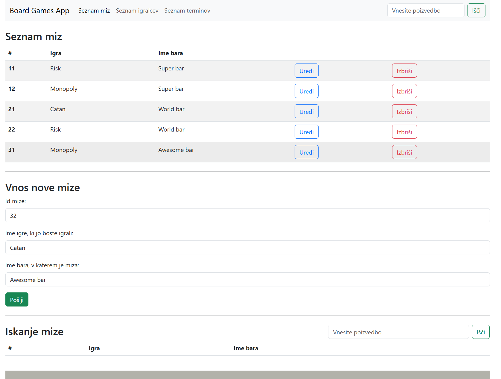
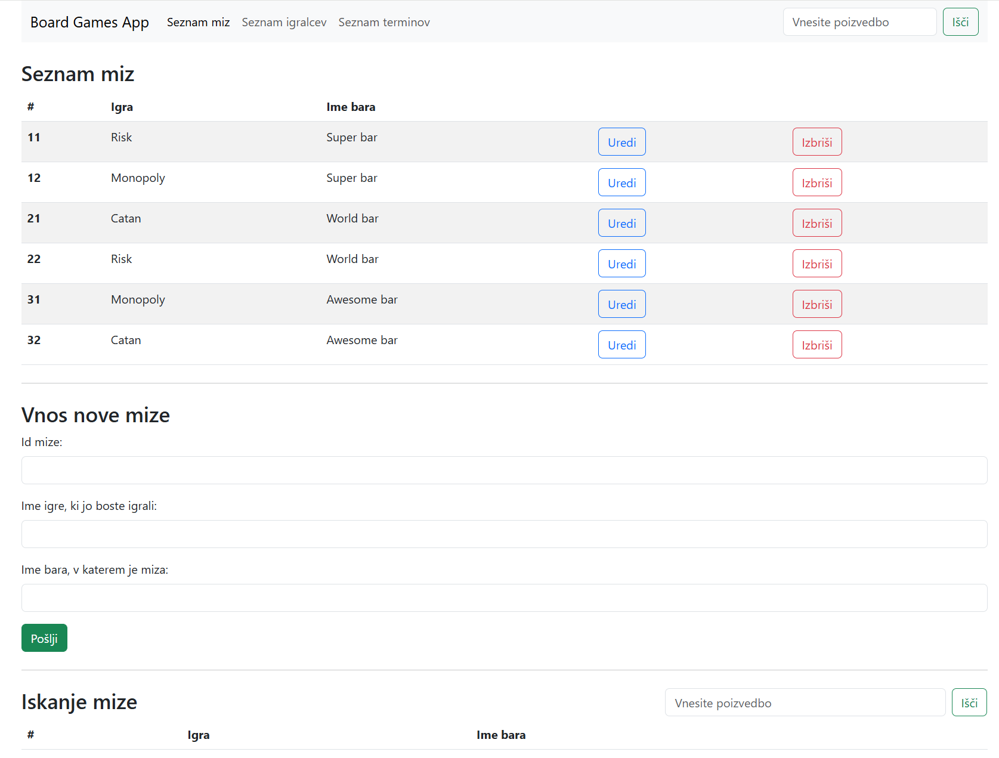
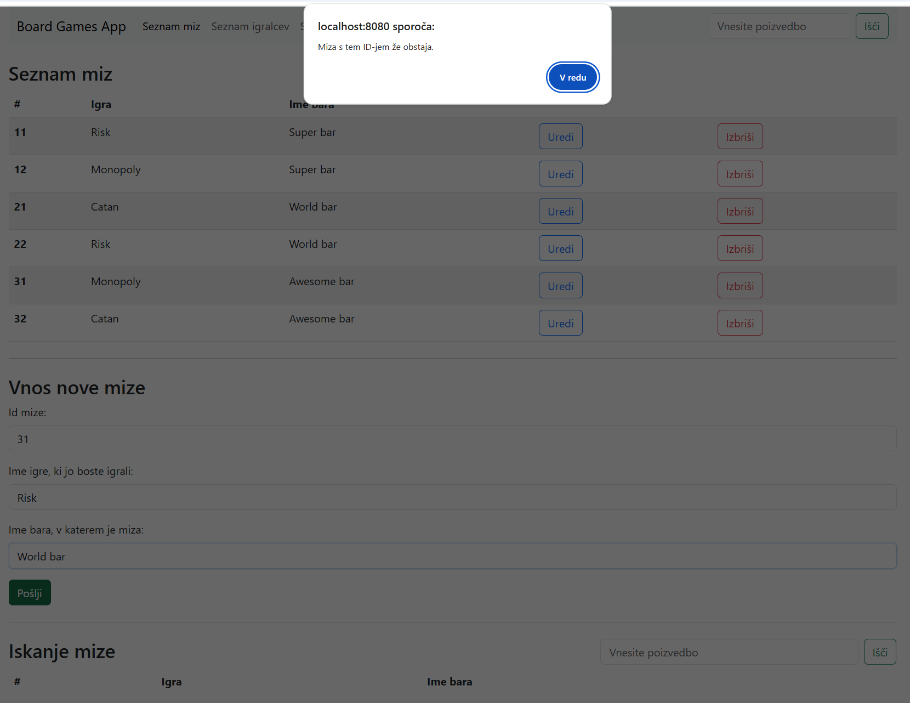
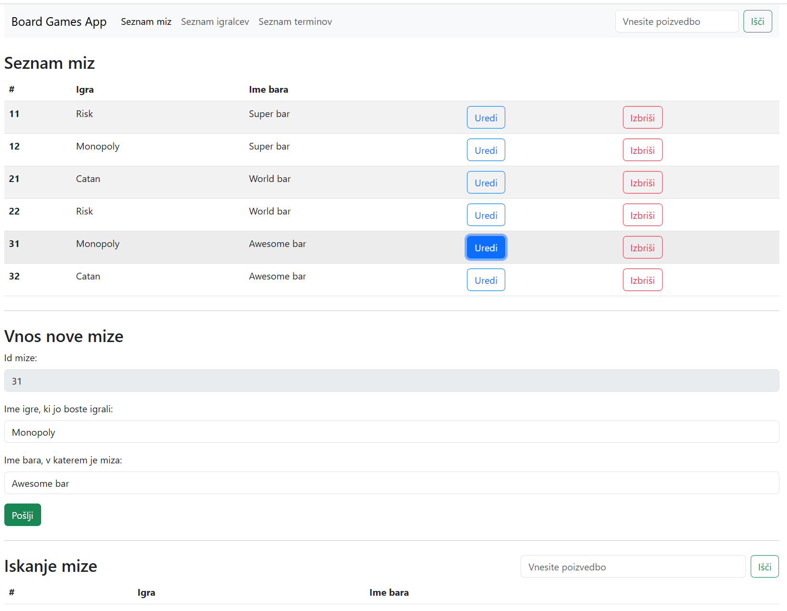
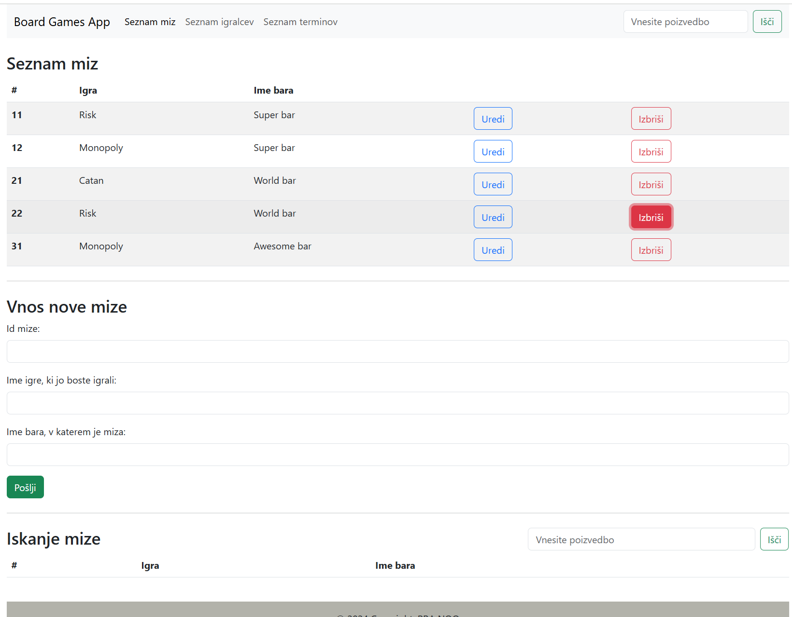
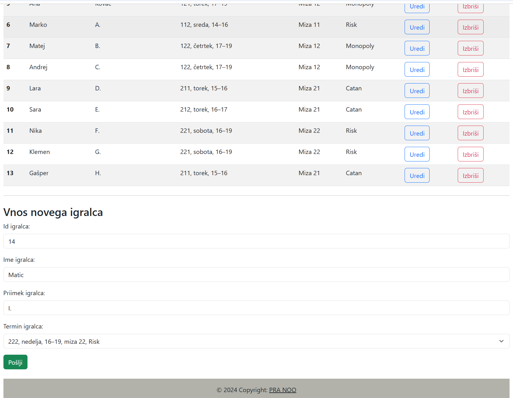
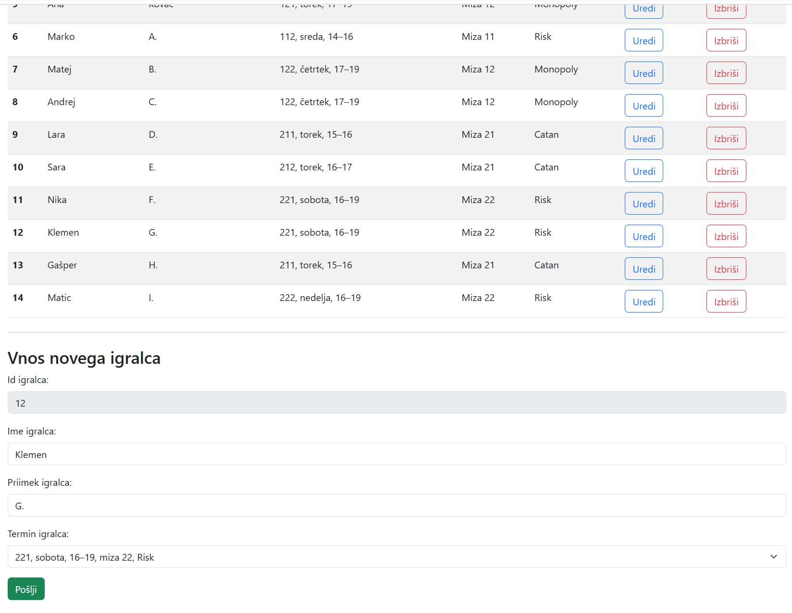
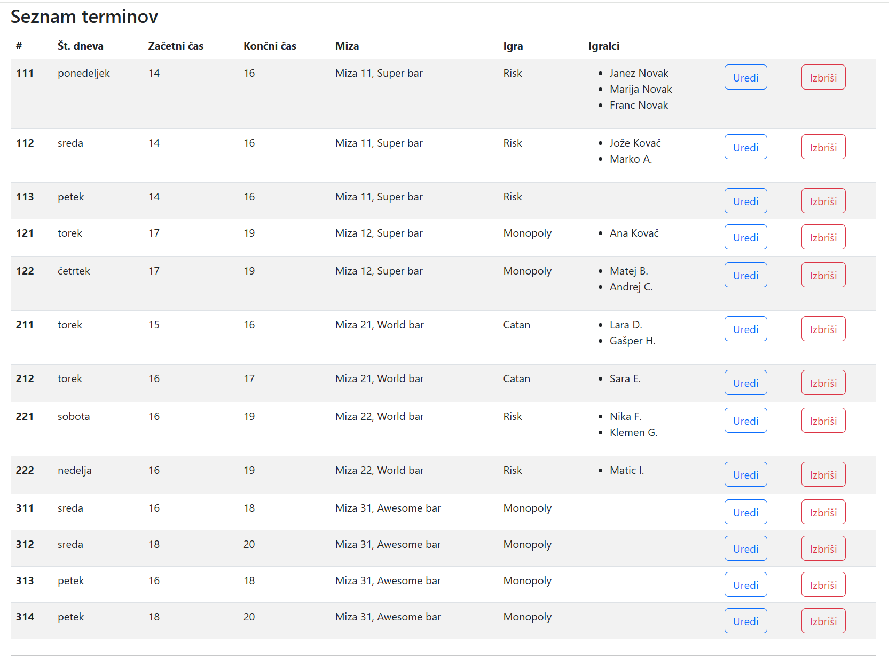
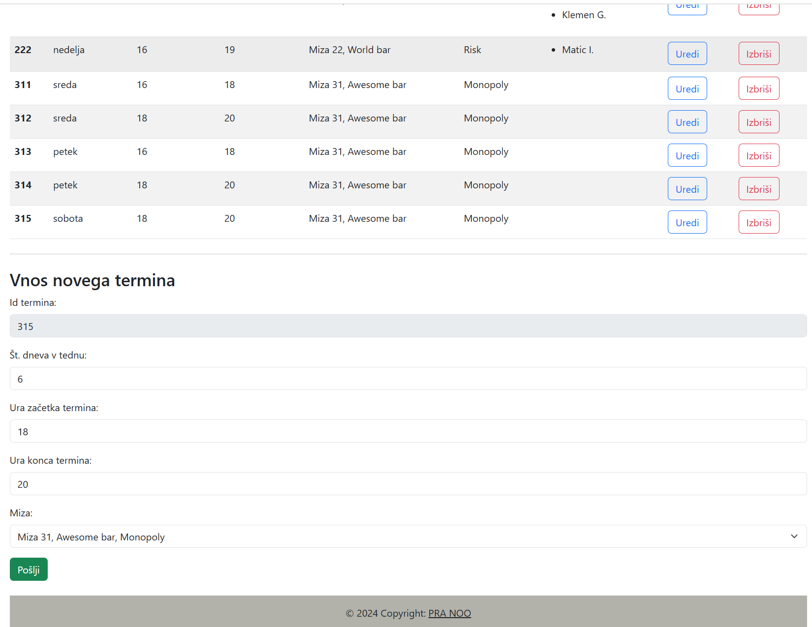

[RULES IN ENGLISH BELOW]

To je primer spletne aplikacije, v katero bi se lahko registrirali različni bari in dali na voljo družabne igre in mize, za katerimi bi jih lahko obiskovalci igrali. Ob vnosu mize je treba navesti Id mize, ime igre in ime bara.

___

Mizo dodate z gumbom »Pošlji« in vidna bo na seznamu miz.

___

Če pri vnosu mize poskušate vnesti obstoječi Id mize, se pojavi sporočilo o napaki.

___

Ob kateri koli mizi lahko kliknete »Uredi« in razdelek za vnos mize se samodejno zapolni s podatki o mizi, le Id mize je zatemnjen. Spremenite želene podatke in kliknite »Pošlji«, da posodobite mizo.

___

Mizo lahko izbrišete tako, da kliknete »Izbriši« ob posamezni mizi.

___

V razdelku »Iskanje mize« lahko vnesete ime igre in prikazane bodo vse mize, na katerih lahko igrate to igro.

___

Na naslednjem zavihku lahko vnesete igralca, ki mora imeti Id igralca, ime, priimek in termin. Termin izberete na spustnem seznamu, dodajate in urejate pa jih lahko na naslednjem zavihku.

___

Tudi podatke o igralcu (razen Id-ja) lahko uredite z gumbom »Uredi« ob igralčevem imenu ali pa izbrišete igralca z možnostjo »Izbriši«.

___

Na tretjem zavihku so prikazani vsi razpoložljivi termini, skupaj s seznamom igralcev, ki so prijavljeni za posamezno mizo.

___

Kot ostale možnosti je tudi termine mogoče dodajati, urejati ali izbrisati. Mizo za termin izberete na spustnem seznamu, mize pa je mogoče urejati na zavihku »Seznam miz«.

___

[ENGLISH]

This is an example of a web app where bars can sign up, offer various board games and designate tables where the guests can play them. When entering a new table, enter Table Id, Game name and Bar name.

___

Add the table with the "Pošlji" button so it will be visible on the list of tables.

___

If you enter an existing Table Id when entering a new table, an error message pops up.

___

Click "Uredi" next to any table to have its data filled into the section to add a new table, with the Table Id grayed out. Change as needed and click "Pošlji" to update it.

___

Click "Izbriši" next to any table to delete it.

___

In the "Iskanje mize" section, you can enter the name of any board game and you will see all tables where this game can be played.

___

On the next tab, enter a new player with Player Id, Name, Surname and Timeslot of this player. Timeslot is picked from a drop-down list, which can be added or edited on the next tab.

___

Player data (except Player Id) can also be edited with the "Uredi" button next to the player. You can also delete a player by clicking "Izbriši".

___

The third tab shows the list of all available timeslots together with a list of players assigned to each table.

___

Similarly to other options, timeslots can also be added, edited or removed. Select the table for the timeslot from a drop-down menu. Tables can be edited on the "Seznam miz" tab.

